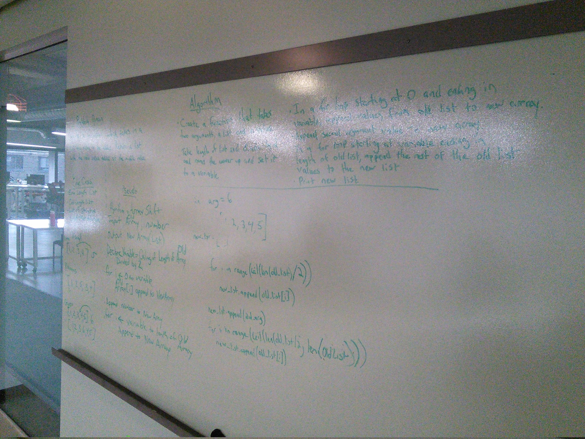

# Insert and shift middle index of array
This is the first whiteboard challenge which offers the challenge of placing a character in the middle of a given list

## Challenge
### from code challenge 02-
Write a function called insertShiftArray which takes in an array and the value to be added. Without utilizing any of the built-in methods available to your language, return an array with the new value added at the middle index.

## Approach & Efficiency

in this challenge the Big O was not evaluated. As for the approach, my partner Raymond Ruazol and I both took turns on the white board - one would do the algorith and the other would pseudo-code. The coding was done independantly

## Solution

