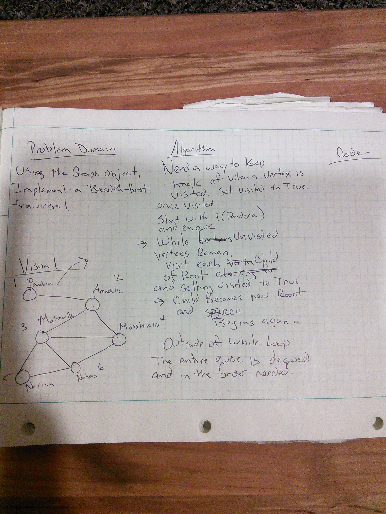

# Traversal breadth first of a graph

## Challenge

Extend your graph object with a breadth-first traversal method that accepts a starting node. Without utilizing any of the built-in methods available to your language, return a collection of nodes in the order they were visited. Display the collection.

## Approach & Efficiency

Because this traverses the entire length of the graph the O time is going to be On -
This method will require some additional data as well to keep track of if a vertex has been visited also

## Solution

