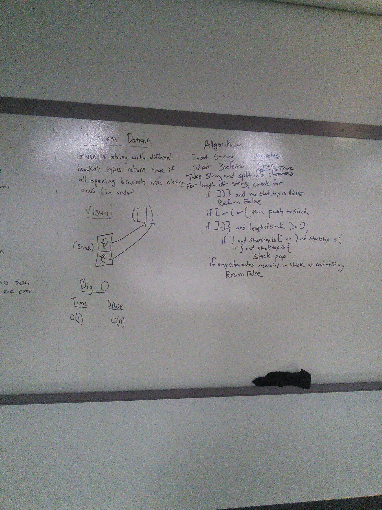

# Get Edges

## Challenge
### from code challenge 27-
Given a business trip itinerary, and an Alaska Airlines route map, is the trip possible with direct flights? If so, how much will the total trip cost be?

Write a function based on the specifications above, which takes in a graph, and an array of city names. Without utilizing any of the built-in methods available to your language, return whether the full trip is possible with direct flights, and how much it would cost.

## Approach & Efficiency
This solution requires the use of iterating through a list so at best the time complexity will be O(n) -

## Solution

