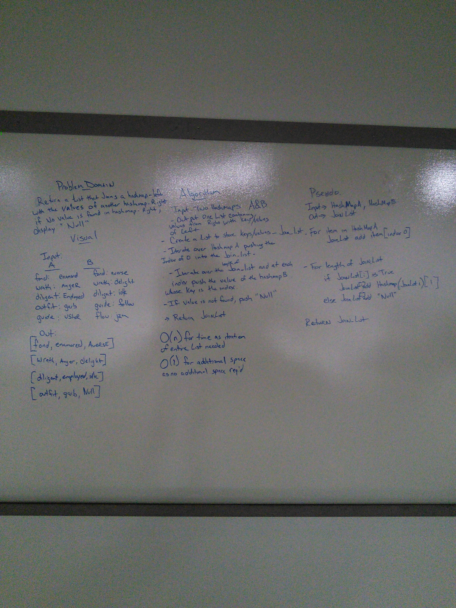

# Hashmap LEFT JOIN
Write a function that LEFT JOINs two hashmaps into a single data structure.

## Challenge

Using two hashmaps (dictionaries) combine the two dictionaries and return the combined values in a list or list like manner

## Approach & Efficiency

A first I intended to put all the dictionary items into a list and then iterate over the list to find the values of the 2nd hash map . After reading the docs on dictionaries, I realized I could take care of it all in the same pass through.
dictionaries has a lookup of O(1). the function does have the range of the length of the dictionary in which to search. The complexity is O(n) for time. This only uses space within the specs of the lab the two dictionaries and the List -

## Solution

## features

-[x] Write a function that LEFT JOINs two hashmaps into a single data structure.

-[x] The first parameter is a hashmap that has word strings as keys, and a synonym of the key as values.

-[x] The second parameter is a hashmap that has word strings as keys, and antonyms of the key as values.

-[x] Combine the key and corresponding values (if they exist) into a new data structure according to LEFT JOIN logic.

-[x] LEFT JOIN means all the values in the first hashmap are returned, and if values exist in the “right” hashmap, they are appended to the result row. If no values exist in the right hashmap, then some flavor of NULL should be appended to the result row.

The returned data structure that holds the results is up to you. It doesn’t need to exactly match the output below, so long as it achieves the LEFT JOIN logic.
-[x] Avoid utilizing any of the library methods available to your language.
