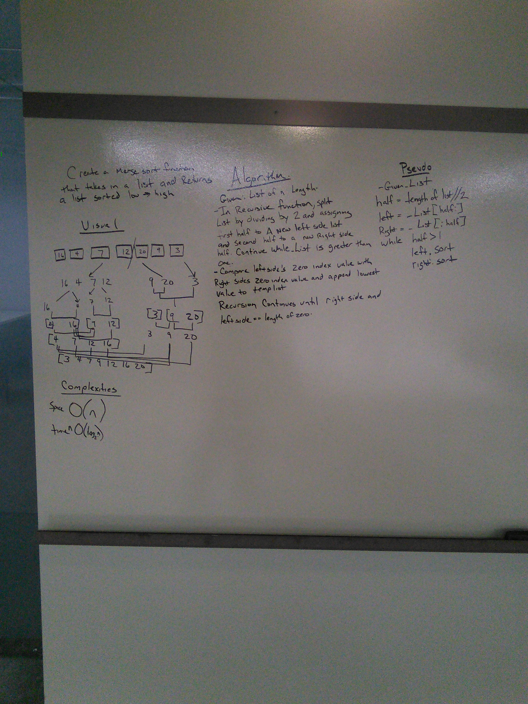

# Mergesort

Implement Mergesort

## Challenge

Write a function that accepts an array of unsorted integers, and returns a sorted array by a recursive mergesort algorithm.

## Approach & Efficiency

This function does make use of a list while operating and the space will be proportional to the size of the list so space complexity is O(n)
Time complexity for this oeration is O(n log n ) -

## Solution

