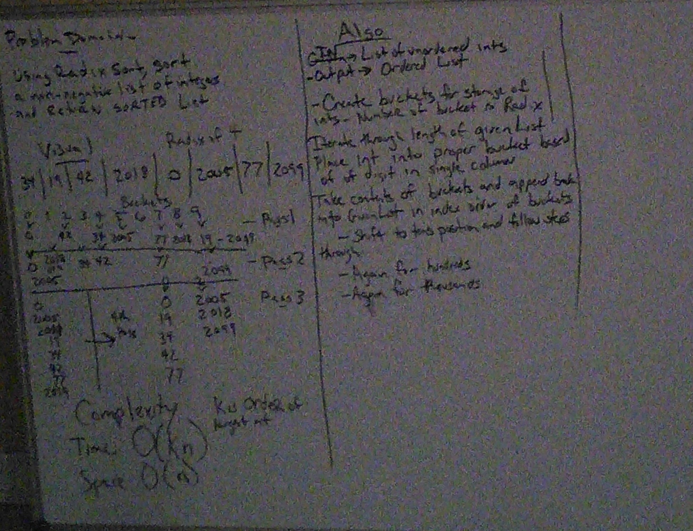

# Radixsort

Implement radix sort.

## Challenge

Write a function that accepts an array of positive integers, and returns an array sorted by a radix sort algorithm.

## Approach & Efficiency

information about Radix comes from https://medium.com/basecs/getting-to-the-root-of-sorting-with-radix-sort
Radix is is a sorting method that sorts integers by their individual numbers rather than by comparison with the other integers in the list.  The method uses the digit as the key and places the integer in to one of ten buckets.  The sort will either be of most significant digit ot least significant digit.  MSD is usually handled recursively nd LSD is handled iteratively.
for time complexity it can be better than comparative sorts but only if the length of the number of digits of the largest integer is constant or smaller than log n, n being the number of elements in the array.
the time complexity is O(kn)
space complexity is O(n) as additional data is created which is proportional to the size of the array being sorted

## Solution

