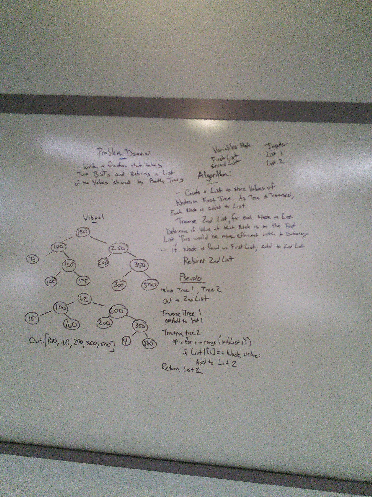

# Intersection of binary trees

Find common values in 2 binary trees.

## Challenge

Write a function called tree_intersection that takes two binary tree parameters.
Without utilizing any of the built-in library methods available to your language, return a set of values found in both trees.

## Approach & Efficiency

Traversing the search tree will result in a time complexity of O(n) as the time will increase with the size of the trees. The space complexity is O(n) as well as this implementation requires additional data to be used (list one)

## Solution

