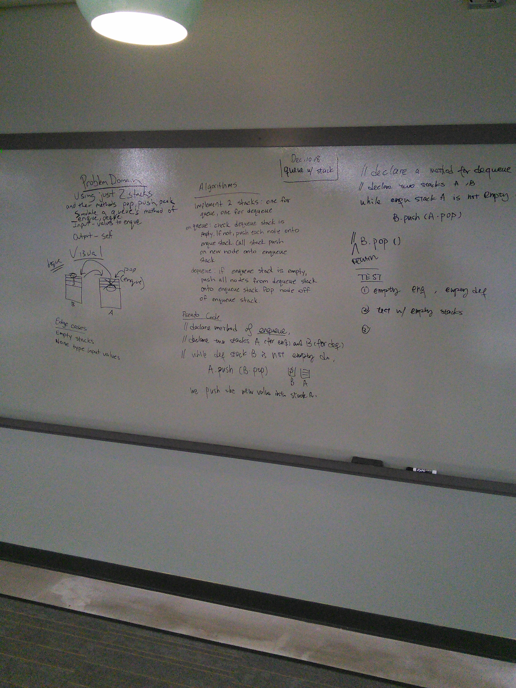

# Breadth-first
This exercise is a breadth first search of a binary tree adding a method to a previous class for binary tree

## Challenge
Write a breadth first traversal method which takes a Binary Tree as its unique input. Without utilizing any of the built-in methods available to your language, traverse the input tree using a Breadth-first approach; print every visited node’s value.

## Approach & Efficiency
big O for time is O(n) as this requires full traversal of every node.
The is a space of O(n) as well as auxilliary space is required by the use of the queue . In a worst case scenario with a very long branch this could be substantial

## Solution

