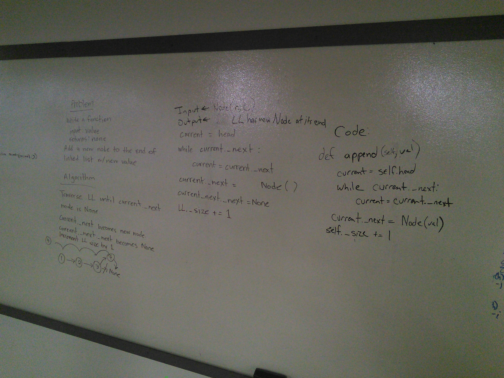

## insert before and insert after
This lab introduces two new methods to the class Linked list, Both insert_before and inset_after take a search value to find in the list and a value for the new node. Insert before calls for the node to be placed after the node with the search value and insert before is placed before

## kth from the end of a Linked List
This lab adds to the linked list object by introducing a method for find in the value of a node a variable k distance from the end.

## Challenge
create the method and establish tests at least three for each method.

## Approach & Efficiency
As this is a traversal issue with a linked list, this is an O(n).
The solution was chosen as it seeks to limit the traversing needed for the solution.

## Solution

